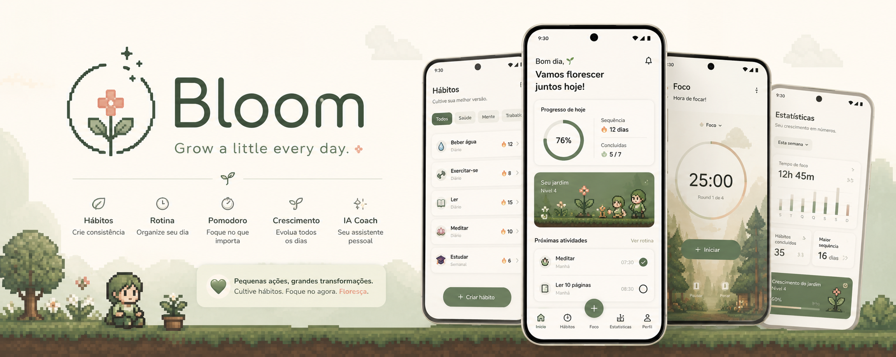

# Bloom



Bloom is a native Android app for habits, routine planning, Pomodoro focus, personal growth, and local AI coaching.

It follows an Organic Productivity design language: calm, premium, minimal, and warm, with pixel-art details reserved for illustrations, rewards, and empty states.

## What Bloom does

- Helps users build daily habits
- Organizes routines by time of day
- Runs a functional Pomodoro timer
- Stores data locally with Room and DataStore
- Tracks streaks, sessions, and progress
- Offers Bloom Coach, an AI assistant powered by Groq when configured

## Stack

- Kotlin
- Jetpack Compose
- Material 3
- Navigation Compose
- ViewModel
- Coroutines and Flow
- Room
- DataStore
- MVVM with `ui`, `domain`, and `data`

## Main screens

- Splash
- Onboarding
- Home dashboard
- Habits
- Create and edit habit
- Routine timeline
- Pomodoro focus
- Statistics
- Garden and rewards
- Profile and settings
- Bloom Coach AI

## Local AI setup

Bloom Coach uses Groq when the API key is configured in `app/local.properties`.

```properties
groqApiKey=your_groq_api_key_here
groqModel=groq/compound-mini
groqBaseUrl=https://api.groq.com/openai/v1
```

If the key is missing, the app keeps working with local fallback guidance.

## Documentation

- Technical guide: [docs/TECHNICAL.md](docs/TECHNICAL.md)
- User guide: [docs/USER_GUIDE.md](docs/USER_GUIDE.md)

## Project structure

```text
app/src/main/java/com/bloom/app
  data
  domain
  ui
```

## Installation and test

1. Open the install page from `outputs/bloom-install/index.html`.
2. Scan the QR code shown on the page.
3. Download `Bloom-debug.apk`.
4. Allow installs from unknown sources if Android asks.
5. Open Bloom and complete onboarding.

## Notes

- The project is structured as a local-first MVP.
- No backend login is implemented yet.
- The APK and install page are provided in `outputs/bloom-install`.
